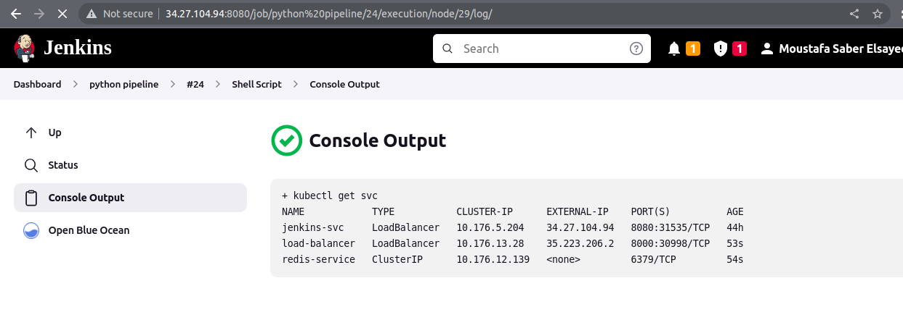
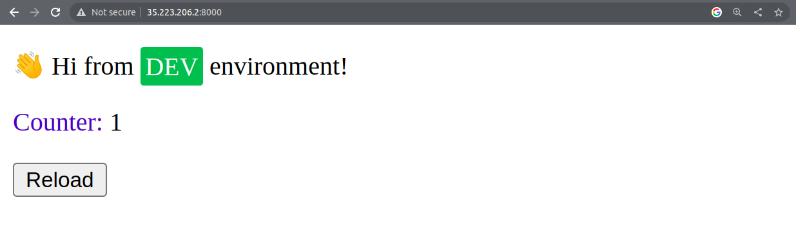

# python-app-cicd-project
Deploying python App using Jenkins Pipeline on GKE Created by Terraform
# Deploy Python App on GCP Using Kubernetes
## The Used Tools
 - Terraform , Docker , Kubernetes , GCP , Jenkins

## The Provisioned Infastructure: 

- VPC  , Two Subnets( management Subnet - restricted Subnet ) , NAT Gateway 
- Router , Firewall Rule , Private VM , Private GKE Cluster 

## Steps:
### 1) Apply the infrastructure Using Terraform 
```bash
$ terraform apply --var-file prod.tfvars
```

### 2) Connect to the Private VM Via SSH
```bash
$ gcloud compute ssh --zone "us-central1-a" "management-instance"  --tunnel-through-iap --project "moustafa-saber-project"
```
### 3) Connfigure the VM so it Can connect to the private GKE
```bash
$ curl -O https://dl.google.com/dl/cloudsdk/channels/rapid/downloads/google-cloud-cli-394.0.0-linux-x86_64.tar.gz
$ tar -xf google-cloud-cli-394.0.0-linux-x86_64.tar.gz
$ ./google-cloud-sdk/install.sh
$ ./google-cloud-sdk/bin/gcloud init
$ sudo apt-get install google-cloud-sdk-gke-gcloud-auth-plugin
$ sudo apt-get install kubectl
```
### 4) Dockerize jenkins image with docker and kubectl installed on it 
```bash
$ docker build --tag moustafasaber36/jenkins:final . 
```
### 5) Pushing the jenkins image to dockerhub so it can bu pulled from jenkins deployment
```bash 
$ docker login -u="${DOCKER_USERNAME}" -p="${DOCKER_PASSWORD}"
$ docker push moustafasaber36/jenkins:final 

```
### 4) Deploy the jenkins server on the GKE cluster via vm
```bash
$ kubectl apply -f namespace.yml
$ kubectl apply -f storage.yml -n jenkins
$ kubectl apply -f serviceaccount.yml -n jenkins
$ kubectl apply -f jenkins-deploy.yml -n jenkins
$ kubectl apply -f jenkins-service.yml -n jenkins
$ kubectl apply -f loadbalancer.yml -n jenkins
```
### 5) Accessing the jenkins server by its external ip 
### 5)checking  connection to the cluster
```bash
$ gcloud container clusters get-credentials my-gke-cluster --zone us-central1-a --project moustafa-saber-project
$ kubectl get nodes 
```
### 6) Building apipeline on the jenkins server provided with git repository of the python app

#### 1)Stage 1 : Fetching the code 
```
	 git 'https://github.com/mustafasaber36/python-app-cicd.git'

```
#### 2)Stage 2 : Building the artifact
```
  docker build . -f ~/workspace/'python pipeline'/python-app/Dockerfile -t moustafasaber36/app:python
  docker login -u ${USERNAME} -p ${PASSWORD}
  docker push moustafasaber36/app:python
```
#### 3) stage 3 : Deploy The app on GKE cluster
```
  sh 'kubectl apply -f ~/workspace/"python pipeline"/kubernetes/redis.yml'
  sh 'kubectl apply -f ~/workspace/"python pipeline"/kubernetes/backend-servcie.yml' 
  sh 'kubectl apply -f ~/workspace/"python pipeline"/kubernetes/project-python.yml'
  sh 'kubectl apply -f ~/workspace/"python pipeline"/kubernetes/frontend-service.yml'
  sh 'kubectl get svc'
```
### 7) Getting the external ip of the loadbalancer service 



### 7) checking the running app 

